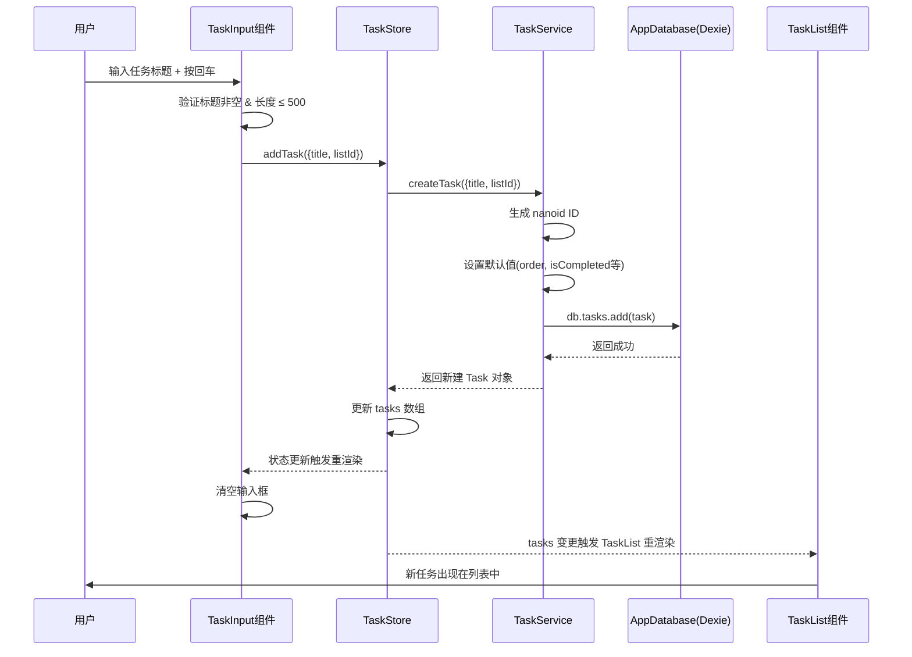
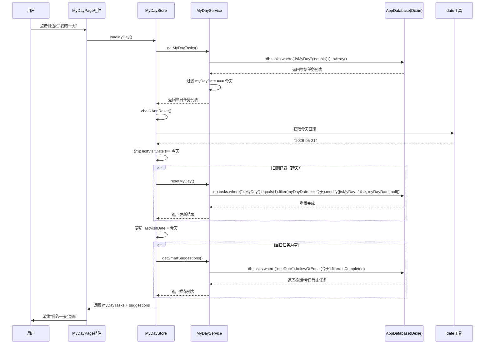
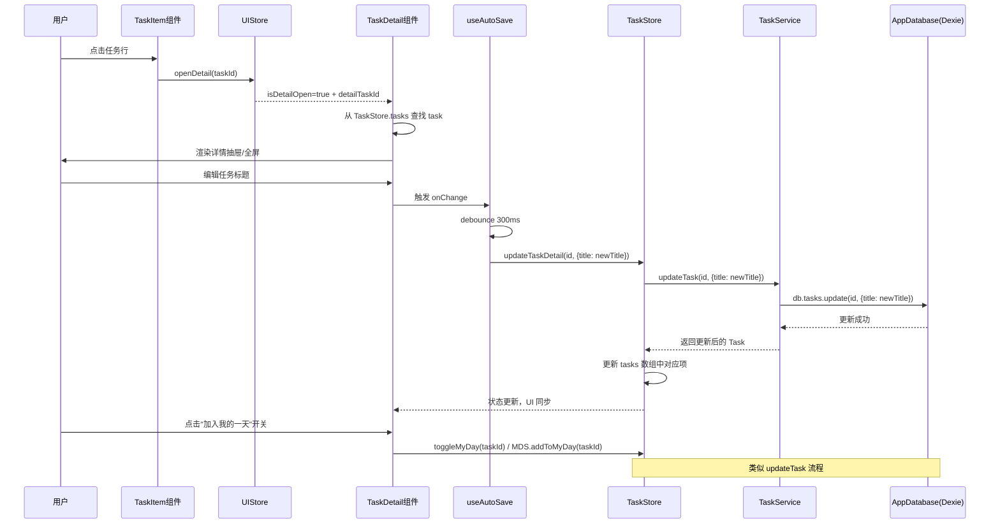
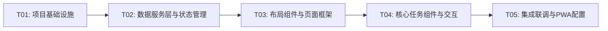

# 系统架构设计文档：任务管理应用（Todo App）

**文档版本**：v1.0  
**创建日期**：2026-05-21  
**架构师**：高见远（Gao）  
**状态**：待评审

---

## 1. 实现方案与框架选型

### 1.1 核心技术挑战

| 挑战 | 分析 | 应对方案 |
|------|------|----------|
| 本地数据持久化与查询 | IndexedDB 是异步 API，原生操作复杂，需结构化查询（按清单、日期、完成状态筛选） | 使用 Dexie.js 封装 IndexedDB，提供类 ORM 的链式查询 API |
| "我的一天"跨天重置 | 需检测日期变更并自动清空，App 长期后台时首次交互触发 | Zustand store 记录上次访问日期，每次进入视图时比对 |
| 响应式布局切换 | 桌面双栏 ↔ 移动端单栏 + 底部 Tab，详情抽屉 ↔ 全屏 | MUI `useMediaQuery` + 自定义 `useResponsive` hook，布局组件条件渲染 |
| 拖拽排序 | 清单内任务拖拽排序，需兼顾桌面鼠标与移动触摸 | @dnd-kit/sortable 统一处理，支持 pointer sensor + touch sensor |
| PWA 离线缓存 | 需 Service Worker 拦截请求，缓存 App Shell | Vite PWA 插件（vite-plugin-pwa）自动生成 SW，workbox 策略 |
| 实时自动保存 | 任务详情编辑后无需点击保存按钮 | Zustand `subscribe` + Dexie `put` 联动，debounce 写入 |

### 1.2 框架与库选型确认

| 类别 | 选型 | 版本 | 选择理由 |
|------|------|------|----------|
| 构建工具 | Vite | ^5.4.0 | 极速 HMR，原生 ESM，零配置 TypeScript |
| 前端框架 | React | ^18.3.0 | 生态成熟，Concurrent Mode 支持，团队熟悉 |
| UI 组件库 | MUI | ^5.16.0 | Material Design 3 规范，组件完整，主题定制强 |
| CSS 工具 | Tailwind CSS | ^3.4.0 | 原子化 CSS，补充 MUI 不覆盖的自定义布局和间距 |
| 状态管理 | Zustand | ^4.5.0 | 极简 API，无 Provider 包裹，内置 subscribe/selector 优化重渲染 |
| 本地数据库 | Dexie.js | ^4.0.0 | IndexedDB 的优雅封装，支持事务、索引、链式查询 |
| 日期处理 | dayjs | ^1.11.0 | 2KB 体积，moment 兼容 API，插件化按需加载 |
| 拖拽排序 | @dnd-kit/sortable | ^8.0.0 | 无障碍友好，React 原生，性能优于 react-beautiful-dnd |
| UUID 生成 | nanoid | ^5.0.0 | 比 uuid 更小更快，URL 安全，适合前端 ID 生成 |
| PWA 支持 | vite-plugin-pwa | ^0.20.0 | Vite 官方推荐，自动生成 Service Worker 和 manifest |
| 图标库 | @mui/icons-material | ^5.16.0 | MUI 配套图标，包含 Material Design 全部图标 |
| 动画 | framer-motion | ^11.0.0 | 声明式动画，任务完成/删除过渡效果流畅 |
| 通知 | Web Notifications API | 原生 | 浏览器内置，无需第三方库 |
| i18n 预留 | react-i18next | ^14.0.0 | 社区标准，代码结构预留，MVP 仅中文 |

### 1.3 架构模式

采用 **MVVM 变体**（Model - ViewModel(Store) - View）：

```
View (React Components)
  ↕ 读写
ViewModel (Zustand Store)  ←→  Service Layer (业务逻辑)
  ↕ 订阅/持久化
Model (Dexie.js / IndexedDB)
```

- **View**：纯展示 + 事件触发，不包含业务逻辑
- **ViewModel (Store)**：Zustand store 管理应用状态，通过 Service 层与数据库交互
- **Model**：Dexie.js 定义数据表结构和索引
- **Service Layer**：封装数据库操作和业务逻辑（如"我的一天"重置、重复任务生成）

---

## 2. 文件列表及相对路径

```
todo-app/
├── index.html                              # HTML 入口
├── package.json                            # 依赖声明
├── vite.config.ts                          # Vite 构建配置
├── tsconfig.json                           # TypeScript 配置
├── tsconfig.node.json                      # Node 环境 TS 配置
├── tailwind.config.ts                      # Tailwind 配置
├── postcss.config.js                       # PostCSS 配置
├── public/
│   ├── favicon.ico                         # 网站图标
│   ├── manifest.json                       # PWA manifest（vite-plugin-pwa 自动生成，此处放自定义图标）
│   └── icons/                              # PWA 各尺寸图标
│       ├── icon-192.png
│       └── icon-512.png
├── src/
│   ├── main.tsx                            # React 入口，挂载 App
│   ├── App.tsx                             # 根组件：ThemeProvider + Layout + Router
│   ├── vite-env.d.ts                       # Vite 类型声明
│   │
│   ├── types/                              # 全局类型定义
│   │   └── index.ts                        # TaskList, Task, Subtask, RepeatRule 等接口
│   │
│   ├── db/                                 # 数据库层
│   │   └── index.ts                        # Dexie 数据库实例定义（表结构、索引）
│   │
│   ├── services/                           # 业务服务层
│   │   ├── taskService.ts                  # 任务 CRUD + 重复任务生成 + 排序
│   │   ├── listService.ts                  # 清单 CRUD + 排序
│   │   ├── myDayService.ts                 # "我的一天"逻辑：加入/移出/跨天重置/智能推荐
│   │   └── notificationService.ts          # Web Notifications 权限请求 + 定时提醒调度
│   │
│   ├── stores/                             # Zustand 状态管理
│   │   ├── taskStore.ts                    # 任务状态：列表、筛选、CRUD 操作
│   │   ├── listStore.ts                    # 清单状态：列表、当前选中清单
│   │   ├── uiStore.ts                      # UI 状态：侧边栏开关、详情抽屉、移动端 Tab
│   │   └── myDayStore.ts                   # "我的一天"状态：当日任务、推荐任务、日期检测
│   │
│   ├── hooks/                              # 自定义 Hooks
│   │   ├── useResponsive.ts                # 响应式断点判断（isMobile, isTablet, isDesktop）
│   │   ├── useDatabase.ts                  # Dexie 数据库初始化 + 实时订阅钩子
│   │   ├── useMyDayReset.ts                # "我的一天"跨天重置检测
│   │   ├── useNotification.ts              # 通知权限请求 + 提醒调度
│   │   └── useAutoSave.ts                  # 任务详情自动保存（debounce）
│   │
│   ├── components/                         # 通用 UI 组件
│   │   ├── Layout/
│   │   │   ├── AppLayout.tsx               # 主布局：侧边栏 + 内容区
│   │   │   ├── Sidebar.tsx                 # 左侧边栏：导航 + 清单列表
│   │   │   ├── MobileNav.tsx               # 移动端底部 Tab 栏
│   │   │   └── Header.tsx                  # 内容区顶部栏（标题 + 搜索入口）
│   │   ├── Task/
│   │   │   ├── TaskItem.tsx                # 单个任务行（复选框 + 标题 + 日期 + 星标）
│   │   │   ├── TaskList.tsx                # 任务列表容器（未完成 + 已完成折叠）
│   │   │   ├── TaskInput.tsx               # 快速添加任务输入框
│   │   │   ├── TaskDetail.tsx              # 任务详情抽屉/全屏
│   │   │   ├── TaskDetailFields.tsx        # 详情字段组（日期/提醒/重复/清单等）
│   │   │   ├── SubtaskList.tsx             # 子任务列表 + 输入
│   │   │   └── CompletedSection.tsx        # 已完成任务折叠区
│   │   ├── List/
│   │   │   ├── ListItem.tsx                # 侧边栏清单项（图标 + 名称 + 计数）
│   │   │   ├── ListForm.tsx                # 新建/编辑清单表单（内联 + 弹窗）
│   │   │   └── ListContextMenu.tsx         # 清单右键菜单（重命名/颜色/删除）
│   │   ├── MyDay/
│   │   │   ├── MyDayHeader.tsx             # "我的一天"顶部（日期 + 欢迎语）
│   │   │   └── SmartSuggestion.tsx         # 智能推荐面板（推荐今日截止/逾期任务）
│   │   ├── Common/
│   │   │   ├── ConfirmDialog.tsx           # 通用确认弹窗
│   │   │   ├── DatePicker.tsx              # 日期选择器（封装 MUI DatePicker + 快捷选项）
│   │   │   ├── EmptyState.tsx              # 空状态占位组件
│   │   │   └── SearchBar.tsx               # 全局搜索输入框
│   │   └── Sortable/
│   │       └── SortableTaskList.tsx        # 可拖拽排序的任务列表（@dnd-kit 封装）
│   │
│   ├── pages/                              # 页面级组件
│   │   ├── MyDayPage.tsx                   # "我的一天"页面
│   │   ├── ImportantPage.tsx               # "重要"页面（P1）
│   │   ├── PlannedPage.tsx                 # "计划内"页面（P1）
│   │   ├── InboxPage.tsx                   # "任务"（默认收件箱）页面
│   │   ├── ListDetailPage.tsx              # 自定义清单详情页面
│   │   └── SearchPage.tsx                  # 搜索结果页面（P1）
│   │
│   ├── utils/                              # 工具函数
│   │   ├── id.ts                           # nanoid 封装的 ID 生成器
│   │   ├── date.ts                         # dayjs 封装：格式化、比较、快捷日期
│   │   ├── constants.ts                    # 常量定义：默认清单、颜色列表、重复规则枚举
│   │   └── storage.ts                      # localStorage 辅助（存取 UI 偏好设置）
│   │
│   ├── i18n/                               # 国际化（预留结构）
│   │   ├── index.ts                        # i18next 初始化
│   │   └── locales/
│   │       └── zh-CN.json                  # 中文翻译文件
│   │
│   └── styles/                             # 全局样式
│       ├── global.css                      # 全局 CSS（Tailwind 指令 + 自定义样式）
│       └── theme.ts                        # MUI 主题定制（颜色、字体、圆角）
│
└── docs/
    ├── PRD.md                              # 产品需求文档
    ├── ARCHITECTURE.md                     # 本文档
    ├── class-diagram.mermaid               # 类图
    └── sequence-diagram.mermaid            # 时序图
```

**文件职责说明**：

| 文件 | 职责 |
|------|------|
| `src/types/index.ts` | 所有 TypeScript 接口和类型定义，是数据模型的唯一真相源 |
| `src/db/index.ts` | Dexie 数据库实例，定义表名、索引、版本迁移策略 |
| `src/services/*.ts` | 纯业务逻辑，不依赖 React，可独立测试 |
| `src/stores/*.ts` | Zustand store，连接 Service 层和 View 层，管理应用状态 |
| `src/hooks/*.ts` | 封装可复用的有状态逻辑，供组件调用 |
| `src/components/` | 纯 UI 组件，通过 props 和 store 交互，不含业务逻辑 |
| `src/pages/` | 页面级组件，组合 components，对应路由 |
| `src/utils/` | 无副作用的纯工具函数 |

---

## 3. 数据结构与接口（类图）

```mermaid
classDiagram
    class TaskList {
        +string id
        +string name
        +string color
        +string icon
        +number order
        +Date createdAt
        +boolean isDefault
    }

    class Task {
        +string id
        +string title
        +string note
        +string listId
        +boolean isCompleted
        +boolean isImportant
        +boolean isMyDay
        +string myDayDate
        +Date dueDate
        +Date reminder
        +RepeatRule repeat
        +Subtask[] subtasks
        +number order
        +Date createdAt
        +Date completedAt
    }

    class Subtask {
        +string id
        +string title
        +boolean isCompleted
        +number order
    }

    class RepeatRule {
        +RepeatFrequency frequency
        +number interval
        +number[] byDayOfWeek
        +number byDayOfMonth
        +Date until
    }

    class RepeatFrequency {
        <<enumeration>>
        DAILY
        WEEKLY
        MONTHLY
        YEARLY
    }

    class AppDatabase {
        +Dexie.Table~Task~ tasks
        +Dexie.Table~TaskList~ lists
        +init() Promise~void~
        +getInitialData() Promise~InitialData~
    }

    class TaskService {
        +createTask(data: CreateTaskInput) Promise~Task~
        +updateTask(id: string, data: Partial~Task~) Promise~Task~
        +deleteTask(id: string) Promise~void~
        +completeTask(id: string) Promise~Task~
        +uncompleteTask(id: string) Promise~Task~
        +getTasksByList(listId: string) Promise~Task[]~
        +getImportantTasks() Promise~Task[]~
        +getPlannedTasks() Promise~Task[]~
        +searchTasks(keyword: string) Promise~Task[]~
        +generateRepeatTask(task: Task) Promise~Task~
        +reorderTasks(taskIds: string[]) Promise~void~
    }

    class ListService {
        +createList(data: CreateListInput) Promise~TaskList~
        +updateList(id: string, data: Partial~TaskList~) Promise~TaskList~
        +deleteList(id: string) Promise~void~
        +getAllLists() Promise~TaskList[]~
        +reorderLists(listIds: string[]) Promise~void~
    }

    class MyDayService {
        +addToMyDay(taskId: string) Promise~Task~
        +removeFromMyDay(taskId: string) Promise~Task~
        +getMyDayTasks() Promise~Task[]~
        +resetMyDay() Promise~void~
        +getSmartSuggestions() Promise~Task[]~
    }

    class NotificationService {
        +requestPermission() Promise~NotificationPermission~
        +scheduleReminder(task: Task) void
        +cancelReminder(taskId: string) void
        +checkAndNotify() void
    }

    class TaskStore {
        +Task[] tasks
        +string currentListId
        +boolean isLoading
        +loadTasks(listId: string) Promise~void~
        +addTask(data: CreateTaskInput) Promise~void~
        +toggleComplete(id: string) Promise~void~
        +toggleImportant(id: string) Promise~void~
        +removeTask(id: string) Promise~void~
        +updateTaskDetail(id: string, data: Partial~Task~) Promise~void~
        +reorderTasks(taskIds: string[]) Promise~void~
    }

    class ListStore {
        +TaskList[] lists
        +string activeListId
        +boolean isLoading
        +loadLists() Promise~void~
        +addList(data: CreateListInput) Promise~void~
        +updateList(id: string, data: Partial~TaskList~) Promise~void~
        +removeList(id: string) Promise~void~
        +setActiveList(id: string) void
    }

    class MyDayStore {
        +Task[] myDayTasks
        +Task[] suggestions
        +string lastVisitDate
        +boolean isLoading
        +loadMyDay() Promise~void~
        +addToMyDay(taskId: string) Promise~void~
        +removeFromMyDay(taskId: string) Promise~void~
        +checkAndReset() Promise~void~
        +loadSuggestions() Promise~void~
    }

    class UIStore {
        +boolean sidebarOpen
        +string detailTaskId
        +boolean isDetailOpen
        +string activeMobileTab
        +toggleSidebar() void
        +openDetail(taskId: string) void
        +closeDetail() void
        +setMobileTab(tab: string) void
    }

    Task "1" --> "0..*" Subtask : contains
    Task "0..1" --> "0..1" RepeatRule : has
    RepeatRule --> RepeatFrequency : uses
    Task " *" --> "1" TaskList : belongsTo
    TaskService --> AppDatabase : reads/writes
    ListService --> AppDatabase : reads/writes
    MyDayService --> AppDatabase : reads/writes
    NotificationService --> AppDatabase : reads
    TaskStore --> TaskService : calls
    ListStore --> ListService : calls
    MyDayStore --> MyDayService : calls
```



---

## 4. 程序调用流程（时序图）

### 4.1 创建任务流程



### 4.2 "我的一天"视图加载流程



### 4.3 任务详情编辑流程



---

## 5. 任务列表

### 5.1 依赖包列表

```
- react@^18.3.1: UI 框架
- react-dom@^18.3.1: React DOM 渲染
- @mui/material@^5.16.0: Material Design 组件库
- @mui/icons-material@^5.16.0: MUI 图标库
- @emotion/react@^11.11.0: MUI 样式引擎（CSS-in-JS）
- @emotion/styled@^11.11.0: MUI styled API
- @dnd-kit/core@^6.1.0: 拖拽核心库
- @dnd-kit/sortable@^8.0.0: 拖拽排序
- @dnd-kit/utilities@^3.2.0: 拖拽工具函数
- zustand@^4.5.0: 轻量状态管理
- dexie@^4.0.4: IndexedDB 封装
- dexie-react-hooks@^1.1.7: Dexie React 集成 hooks
- dayjs@^1.11.10: 日期处理
- nanoid@^5.0.7: 轻量 ID 生成
- framer-motion@^11.0.0: 动画库
- react-i18next@^14.1.0: 国际化
- i18next@^23.11.0: i18n 核心
- @mui/x-date-pickers@^7.6.0: MUI 日期选择器
- vite-plugin-pwa@^0.20.0: PWA 支持
- workbox-window@^7.1.0: Service Worker 通信

开发依赖：
- typescript@^5.5.0: TypeScript 编译器
- vite@^5.4.0: 构建工具
- @vitejs/plugin-react@^4.3.0: Vite React 插件
- tailwindcss@^3.4.0: 原子化 CSS
- postcss@^8.4.0: CSS 处理器
- autoprefixer@^10.4.0: CSS 前缀自动补全
- @types/react@^18.3.0: React 类型定义
- @types/react-dom@^18.3.0: React DOM 类型定义
- eslint@^8.57.0: 代码检查
- prettier@^3.3.0: 代码格式化
```

### 5.2 任务分解（按实现顺序）

---

#### T01: 项目基础设施与开发环境

**任务名称**：项目基础设施与开发环境搭建  
**描述**：初始化 Vite + React + TypeScript 项目，配置构建工具链（Tailwind CSS、MUI 主题、PWA 插件），创建应用入口和根组件骨架，定义全局类型，建立 Dexie 数据库模型。  
**源文件**：
- `package.json` — 依赖声明与脚本
- `vite.config.ts` — Vite 配置（React 插件、PWA 插件、路径别名）
- `tsconfig.json` / `tsconfig.node.json` — TypeScript 配置
- `tailwind.config.ts` — Tailwind 配置（与 MUI 共存策略）
- `postcss.config.js` — PostCSS 配置
- `index.html` — HTML 入口
- `src/main.tsx` — React 挂载点
- `src/App.tsx` — 根组件（ThemeProvider + Layout 骨架）
- `src/vite-env.d.ts` — Vite 类型声明
- `src/types/index.ts` — 全局类型定义（TaskList, Task, Subtask, RepeatRule 等）
- `src/db/index.ts` — Dexie 数据库实例（表定义 + 索引 + 初始数据）
- `src/utils/id.ts` — nanoid ID 生成器封装
- `src/utils/date.ts` — dayjs 封装工具函数
- `src/utils/constants.ts` — 常量定义
- `src/utils/storage.ts` — localStorage 辅助函数
- `src/styles/global.css` — 全局样式（Tailwind 指令 + 自定义样式）
- `src/styles/theme.ts` — MUI 主题定制
- `src/i18n/index.ts` — i18next 初始化
- `src/i18n/locales/zh-CN.json` — 中文翻译
- `public/favicon.ico` — 网站图标
- `public/manifest.json` — PWA manifest 基础配置
- `public/icons/icon-192.png` — PWA 图标
- `public/icons/icon-512.png` — PWA 图标

**前置依赖**：无  
**优先级**：P0  
**预估复杂度**：M

---

#### T02: 数据服务层与状态管理

**任务名称**：数据服务层与 Zustand 状态管理  
**描述**：实现所有 Service 类（taskService、listService、myDayService、notificationService）的核心业务逻辑，以及对应的 Zustand Store（taskStore、listStore、myDayStore、uiStore），并编写自定义 Hooks 连接 Store 与组件。  
**源文件**：
- `src/services/taskService.ts` — 任务 CRUD、完成/撤销、排序、重复任务生成
- `src/services/listService.ts` — 清单 CRUD、排序
- `src/services/myDayService.ts` — "我的一天"加入/移出/跨天重置/智能推荐
- `src/services/notificationService.ts` — 通知权限、提醒调度
- `src/stores/taskStore.ts` — 任务状态管理
- `src/stores/listStore.ts` — 清单状态管理
- `src/stores/myDayStore.ts` — "我的一天"状态管理
- `src/stores/uiStore.ts` — UI 状态管理
- `src/hooks/useDatabase.ts` — 数据库初始化钩子
- `src/hooks/useMyDayReset.ts` — 跨天重置检测钩子
- `src/hooks/useNotification.ts` — 通知权限钩子
- `src/hooks/useAutoSave.ts` — 自动保存钩子
- `src/hooks/useResponsive.ts` — 响应式断点钩子

**前置依赖**：T01（依赖类型定义和数据库模型）  
**优先级**：P0  
**预估复杂度**：L

---

#### T03: 布局组件与页面框架

**任务名称**：布局组件与页面框架搭建  
**描述**：实现应用整体布局（AppLayout 桌面双栏 + 移动端单栏），侧边栏导航与清单列表，移动端底部 Tab 栏，内容区 Header，以及所有页面级组件的骨架。  
**源文件**：
- `src/components/Layout/AppLayout.tsx` — 主布局容器
- `src/components/Layout/Sidebar.tsx` — 左侧边栏
- `src/components/Layout/MobileNav.tsx` — 移动端底部 Tab
- `src/components/Layout/Header.tsx` — 内容区顶部栏
- `src/components/List/ListItem.tsx` — 清单项组件
- `src/components/List/ListForm.tsx` — 新建/编辑清单表单
- `src/components/List/ListContextMenu.tsx` — 清单右键菜单
- `src/components/Common/ConfirmDialog.tsx` — 确认弹窗
- `src/components/Common/EmptyState.tsx` — 空状态占位
- `src/pages/MyDayPage.tsx` — "我的一天"页面
- `src/pages/ImportantPage.tsx` — "重要"页面
- `src/pages/PlannedPage.tsx` — "计划内"页面
- `src/pages/InboxPage.tsx` — "任务"默认页面
- `src/pages/ListDetailPage.tsx` — 清单详情页面
- `src/pages/SearchPage.tsx` — 搜索页面

**前置依赖**：T02（依赖 Store 和 Hooks）  
**优先级**：P0  
**预估复杂度**：L

---

#### T04: 核心任务组件与交互

**任务名称**：核心任务组件与交互逻辑  
**描述**：实现任务相关的全部交互组件——任务项、任务列表、快速添加输入框、任务详情抽屉、子任务列表、已完成折叠区、"我的一天"头部的智能推荐、日期选择器、拖拽排序、搜索框。这是用户交互最密集的部分。  
**源文件**：
- `src/components/Task/TaskItem.tsx` — 单任务行（复选框 + 标题 + 日期 + 星标）
- `src/components/Task/TaskList.tsx` — 任务列表容器
- `src/components/Task/TaskInput.tsx` — 快速添加任务输入框
- `src/components/Task/TaskDetail.tsx` — 任务详情抽屉/全屏
- `src/components/Task/TaskDetailFields.tsx` — 详情字段组
- `src/components/Task/SubtaskList.tsx` — 子任务列表 + 输入
- `src/components/Task/CompletedSection.tsx` — 已完成折叠区
- `src/components/MyDay/MyDayHeader.tsx` — "我的一天"顶部
- `src/components/MyDay/SmartSuggestion.tsx` — 智能推荐面板
- `src/components/Common/DatePicker.tsx` — 日期选择器（含快捷选项）
- `src/components/Common/SearchBar.tsx` — 全局搜索框
- `src/components/Sortable/SortableTaskList.tsx` — 可拖拽排序列表

**前置依赖**：T03（依赖布局和页面组件作为容器）  
**优先级**：P0  
**预估复杂度**：L

---

#### T05: 集成联调与 PWA 配置

**任务名称**：组件集成联调与 PWA 最终配置  
**描述**：将所有组件集成到页面中，联调数据流与交互逻辑（创建任务 → 列表渲染 → 详情编辑 → 完成折叠 → 跨天重置），修复集成问题；配置 vite-plugin-pwa 的 Service Worker 和 manifest，确保应用可安装和离线可用；最终调优响应式布局和动画效果。  
**源文件**：
- `src/App.tsx` — 完善路由和全局 Provider 嵌套
- `src/main.tsx` — 确认挂载和数据库初始化流程
- `vite.config.ts` — 完善 PWA 插件配置
- `public/manifest.json` — 完善 PWA manifest
- 各页面组件 — 集成任务组件、修正数据流
- 各 Store — 联调修正边界情况

**前置依赖**：T04  
**优先级**：P0  
**预估复杂度**：M

---

### 5.3 任务依赖关系图



---

## 6. 共享知识（跨文件约定）

### 6.1 命名规范

| 类别 | 规范 | 示例 |
|------|------|------|
| 组件文件 | PascalCase | `TaskItem.tsx`, `MyDayHeader.tsx` |
| 非组件文件 | camelCase | `taskService.ts`, `useAutoSave.ts` |
| 目录名 | PascalCase（组件目录）/ camelCase（其他） | `components/Task/`, `stores/` |
| CSS 类名 | Tailwind 原子类优先，自定义类用 BEM | `task-item__checkbox` |
| 类型/接口 | PascalCase，接口不加 I 前缀 | `Task`, `RepeatRule` |
| 常量 | UPPER_SNAKE_CASE | `DEFAULT_LIST_ID`, `MAX_TASK_TITLE_LENGTH` |
| Store | camelCase + Store 后缀 | `taskStore`, `uiStore` |
| Service | camelCase + Service 后缀 | `taskService`, `myDayService` |
| Hook | use 前缀 + PascalCase | `useAutoSave`, `useResponsive` |
| 事件处理 | handle 前缀 | `handleTaskCreate`, `handleToggleComplete` |

### 6.2 目录结构约定

- `types/`：所有接口和类型定义集中在一个 `index.ts` 中，避免循环依赖
- `db/`：仅包含 Dexie 实例定义，不包含业务逻辑
- `services/`：纯函数/类，不依赖 React，不使用 hooks，可独立单元测试
- `stores/`：Zustand store，通过调用 service 层函数与数据库交互
- `hooks/`：自定义 React hooks，封装可复用有状态逻辑
- `components/`：按功能域分子目录（Task/, List/, Layout/, Common/ 等）
- `pages/`：页面级组件，仅做组件组合和布局，不含复杂逻辑
- `utils/`：纯工具函数，无副作用，无外部依赖（仅工具库）

### 6.3 状态管理模式

```
组件 → Store Action → Service 函数 → Dexie DB
                    ↕
                 Store State 更新 → 组件重渲染
```

- **单一数据源**：每个数据域一个 store（taskStore, listStore, myDayStore, uiStore）
- **Store 职责**：管理内存状态 + 调用 Service 持久化
- **Service 职责**：纯数据操作，返回 Promise，不含 React 逻辑
- **乐观更新**：Store 先更新内存状态，再异步写 DB，失败时回滚
- **自动保存**：使用 `useAutoSave` hook，debounce 300ms 后调用 Store 更新

### 6.4 组件设计模式

- **容器 vs 展示**：页面级组件（pages/）是容器，负责获取数据；子组件（components/）是展示组件，通过 props 接收数据
- **Store 直接访问**：组件可通过 `useTaskStore(state => state.tasks)` 直接读取 store，无需层层 props 传递
- **回调传递**：操作回调通过 props 传递给子组件，或子组件直接调用 store action
- **条件渲染**：使用 `useResponsive` hook 判断设备类型，条件渲染桌面/移动端布局

### 6.5 数据 ID 策略

- 所有实体 ID 使用 `nanoid(21)` 生成，URL 安全，碰撞概率极低
- ID 在前端生成，无需后端协调

### 6.6 日期处理约定

- 数据库中日期字段统一存储为 `Date` 对象（Dexie 自动序列化为 ISO 8601 字符串）
- `myDayDate` 使用 `YYYY-MM-DD` 字符串格式，便于按日精确比较
- 所有日期比较和格式化通过 `src/utils/date.ts` 中的 dayjs 封装函数

### 6.7 MUI 与 Tailwind 共存策略

- MUI 组件的样式优先使用 `sx` prop 和 `styled` API
- Tailwind 用于布局（flex、grid）、间距（p-、m-）、响应式断点
- 避免同一属性同时被 MUI 和 Tailwind 控制
- Tailwind 的 `preflight` 关闭，避免与 MUI 的 CSS Reset 冲突

---

## 7. 待明确事项

| # | 事项 | 影响范围 | 建议方向 |
|---|------|----------|----------|
| 1 | **"我的一天"跨天重置的精确时机** | myDayService、myDayStore | 建议在用户每次进入"我的一天"视图时检测，而非后台定时器。优点：省电、逻辑简单；缺点：用户不打开 App 则不触发（可接受） |
| 2 | **重复任务的实例生成策略** | taskService、数据模型 | P1 功能，但数据模型需预留 `repeat` 字段。建议采用"完成当前任务后自动生成下一个实例"策略，而非"提前生成所有未来实例" |
| 3 | **删除任务是否需要回收站** | taskService、UI 交互 | MVP 建议不做回收站，删除后直接永久删除（有二次确认弹窗）。P2 可考虑软删除 + 30 天回收站 |
| 4 | **默认清单（收件箱）是否可删除** | listService、constants | 建议默认清单不可删除，类似 Microsoft To Do 的"任务"清单。在数据模型中用 `isDefault` 标记 |
| 5 | **MUI 与 Tailwind 的优先级冲突** | 全局样式 | 需在开发初期验证 Tailwind `preflight` 关闭后 MUI 组件的渲染是否正常，可能需要额外的 CSS reset 调整 |
| 6 | **子任务存储方案** | 数据模型 | 当前设计将 `subtasks` 作为 Task 的嵌套字段（JSON 数组）。优点：查询简单；缺点：子任务多时更新效率低。MVP 阶段嵌套方案足够，若子任务超过 100 个的场景出现再考虑独立表 |
| 7 | **PWA 更新策略** | vite-plugin-pwa 配置 | 建议采用 `promptOnUpdate` 策略：检测到新版本时弹窗提示用户刷新，而非静默更新 |

---

*文档结束 — 如有疑问，请联系架构师高见远（Gao）*
